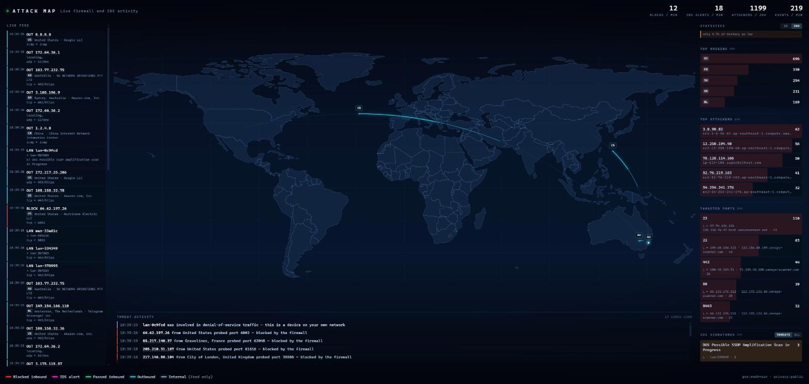

# OPNsense Live Attack Map

A Norse-style live attack map for your own firewall: inbound blocks and Suricata
IDS alerts drawn as animated arcs on a world map in real time, with live
rankings of who is hitting you, from where, and on which ports.



**Safe to publish by default.** Redaction happens server-side, so a screenshot,
a stream, or a publicly exposed instance does not give away your WAN address,
your internal topology, or where you live. See [Privacy](#privacy).

Developed against OPNsense **26.7.x**. It only reads two documented API
endpoints, so it should work on any reasonably recent release.

## What it shows

- **Red arcs** — inbound connections your firewall blocked.
- **Amber → magenta arcs** — Suricata IDS alerts, coloured by severity derived
  from the Emerging Threats signature class (`ET INFO` low … `ET TROJAN` high).
- **Cyan arcs** — outbound traffic. On a typical connection this is ~90% of all
  events, so switch it off when you want only what is hitting you.
- **Live feed** — recent events with geo, ASN owner, port and signature.
- **Rankings** — top origin countries, top attacker addresses, most-targeted
  ports and most-fired IDS signatures, over a rolling hour.
- **Clickable addresses** — every real address in the feed and the attacker
  rankings links to a reputation lookup (Cloudflare Radar by default,
  configurable via `IP_LOOKUP_URL`). Redacted pseudonyms are never linked.

Every arc has one end anchored on your network. That is what makes it read as an
attack map rather than a traffic graph.

## Requirements

- An OPNsense firewall you can reach over HTTPS.
- Node 20+, or Docker.
- Optional: Suricata enabled (Services → Intrusion Detection) for the IDS layer.
  Without it the map runs perfectly well on firewall logs alone.

## Setup

```bash
git clone <this repo>
cd opnsense-attackmap
cp .env.example .env       # fill in OPNSENSE_URL, OPNSENSE_KEY, OPNSENSE_SECRET
npm install
node scripts/smoke.js      # verifies auth, incremental polling and the timezone
node server/index.js       # http://localhost:8474
```

> One smoke-test check samples six seconds of live firewall traffic. On a quiet
> network it can report a failure simply because nothing was logged in that
> window — re-run it before concluding something is broken.

With Docker:

```bash
docker compose up -d --build
```

`node:22-alpine` is multi-arch, so this builds on x86 and ARM (including a NAS)
without changes.

### Getting an API key

**System → Access → Users → _your user_ → API keys → “+”**, then put the key and
secret in `.env`.

An API key is **required for the IDS alert feed**. A session cookie is enough for
`GET`, but the alert endpoint is POST-only and a plain session is rejected by
CSRF. The service falls back to scraping the login form if no key is set, and
firewall logs will still work, but IDS alerts will not.

A dedicated user with read access to the diagnostics and IDS pages is enough —
this tool never writes anything to your firewall.

## Privacy

The point of this section: you should be able to publish this without publishing
yourself.

Redaction runs on the **broadcast path**, not in the browser. Hiding a field in
CSS still ships it over the WebSocket where anyone with devtools can read it. If
something is redacted here, it was never sent.

`PRIVACY=public` is the default:

| Data | `public` | `private` |
|---|---|---|
| WAN address | `wan-f3a4d4` | shown |
| LAN addresses | `lan-cebf28` | shown |
| Interface names | `wan` / `lan` / `opt` | `pppoe0`, `igc1`, … |
| Firewall rule labels | dropped | shown |
| TLS SNI, DNS query names | dropped | shown |
| Home marker position | displaced up to `HOME_FUZZ_KM` | exact |
| ISP / ASN of your line | dropped | shown |
| Outbound destinations | shown | shown |

An address that cannot be geolocated is left without a position rather than
being pinned to the home marker — placing a remote host on your own coordinates
would be both wrong and a way for the home record to escape redaction.

Local addresses become **stable pseudonyms**, so you can still see that the same
host is responsible for a burst without revealing which host it is. The salt
defaults to a fresh random value each boot, so pseudonyms cannot be correlated
across separate publications; pin `PRIVACY_SALT` only if you want them stable,
and treat it as a secret.

The home marker offset is **deterministic** rather than random per frame — a
per-frame jitter could be averaged back to the true position by an observer.

Outbound destination addresses are deliberately never redacted: those are other
people's servers, not yours.

All display text (`SITE_TITLE`, `SITE_SUBTITLE`, `SITE_DESCRIPTION`,
`PAGE_TITLE`) is configurable so the page does not announce whose network it is.

> Even on `public`, this page reveals real activity on a real network — traffic
> volumes, timing patterns, which countries you talk to. Think before exposing an
> instance to the open internet. The page is served without authentication and
> ships a `noindex` header; put it behind your own auth if it needs to be remote.

## Configuration

Everything lives in `.env`; `.env.example` documents every key. The ones that
matter most:

| Variable | Default | Purpose |
|---|---|---|
| `OPNSENSE_URL` | `https://192.168.1.1` | Your firewall. |
| `OPNSENSE_KEY` / `OPNSENSE_SECRET` | – | API credentials. Required for IDS alerts. |
| `PRIVACY` | `public` | `public` or `private`. Individual `SHOW_*` keys override it. |
| `HOME_LAT` / `HOME_LON` | auto | Where “home” sits. Defaults to the geolocation of your WAN address; setting it explicitly is the most reliable way not to reveal where you are. |
| `HOME_FUZZ_KM` | `25` on public | Displacement applied to the home marker. |
| `FW_TZ_OFFSET` | `auto` | See below. |
| `MAP_CENTER_LON` | `0` | Conventional world map. `home` centres on your own longitude. |
| `IP_LOOKUP_URL` | Cloudflare Radar | Where addresses link to; `{ip}` is substituted. Empty disables the links. |
| `COLLAPSE_MS` | `10000` | Window for merging repeat `src → dst:port` hits into one arc. |
| `MAX_ARCS` | `300` | Hard cap, oldest dropped, so a scan burst cannot stall the renderer. |
| `REPLAY` | `0` | Replay recent firewall events at 10× to exercise the renderer. |

### Timezone

The firewall log's `__timestamp__` has **no timezone**, and it is in the
firewall's local time. Parsed naively as UTC, every arc lands hours away from
now. IDS alerts are unaffected — they carry an explicit offset.

`FW_TZ_OFFSET=auto` (the default) infers the offset at startup by comparing a
fresh log line against the current time, snapped to 15 minutes. Pin it
(`+01:00`, `-05:00`, `Z`) if you prefer to be explicit. `scripts/smoke.js`
cross-checks the result against a live IDS alert and fails if the skew exceeds
five minutes.

## GeoIP

**Nothing to set up.** On first run the service downloads MaxMind's GeoLite2
databases (~62 MB City + ~12 MB ASN, about 15 seconds) from
[FyraLabs' mirror](https://github.com/FyraLabs/geolite2) of MaxMind's releases —
no account, no licence key. Lookups are then offline, instant, unlimited, and
carry the ASN/org names that make an attacker line readable
(`CHINANET-BACKBONE`, `DIGITALOCEAN-ASN`) rather than a bare address.

Downloads never block startup — the service comes up on the fallback below and
switches over the moment a database lands. Each file is opened and queried
before it is allowed to replace a working one, so a truncated download cannot
break a good copy.

`GEO_REFRESH_DAYS` (default 7) is both how stale a copy may get and how often
that is checked, so this costs roughly **74 MB per week, not per day** — nothing
is fetched while the local copy is younger than the window. The databases are
cached in a Docker named volume; they are public data, so losing them just means
downloading them again. `GEO_AUTO_DOWNLOAD=0` hands the files back to you.

### The ip-api.com fallback

Used while the first download is in flight, or if it fails. Free and keyless,
but rate-limited to ~15 requests/minute (so a first-seen address takes a few
seconds to place), it sends every address you look at to a third party, and
**IDS rulesets alert on the lookups themselves** — left alone,
`ET POLICY External IP Lookup ip-api.com` becomes your single most frequent
signature, generated entirely by this tool.

`SUPPRESS_GEO_ALERTS=1` (default) filters those out so the feed reflects your
network rather than itself; `/api/health` reports how many were dropped. It only
applies while the fallback is in use — a local database makes no lookups to
alert on. It does also hide genuine lookups to the same service from other
devices, so set it to `0` if that matters.

`/api/health` reports which mode is active: `mmdb+asn`, `mmdb`, or `ip-api`.

## How it works

Two independent pollers, and no configuration change on the firewall:

| Feed | Endpoint | Notes |
|---|---|---|
| Firewall log | `GET /api/diagnostics/firewall/log?limit=…&digest=…` | The `digest` filter returns an exact, gap-free delta. It is **inclusive** of the digest row, which `fwLogSince()` strips — otherwise the boundary event repeats on every poll. |
| IDS alerts | `POST /api/ids/service/queryAlerts` | Full eve.json records: signature, SID, action, TLS SNI, JA3/JA4, DNS queries, flow byte counts. |

The two loops are deliberately independent: the firewall log is the reliable
high-rate feed and must not stall because Suricata is slow, restarting or empty.

### Design notes

- **Volume.** Most events on a home connection are outbound passes. Drawing them
  all is the failure mode of most homemade attack maps, so the default view is
  inbound blocks plus IDS alerts, repeats inside a 10 s window collapse into one
  arc with a hit-count badge, and arcs are hard-capped.
- **Internal traffic.** LAN → LAN events (a host querying the firewall's own
  resolver) have no far end. They are classed `internal`, excluded from the
  attacker rankings, and never drawn as arcs. Without this your own hosts top the
  attacker list.
- **Flat map, flat arcs.** Arcs take the direct chord between two points. Routing
  “the short way” around the antimeridian is correct on a globe, but on a flat
  map it just looks like an attack flying off the wrong edge.
- **Layout.** The map is projected into the gap *between* the side panels rather
  than full-bleed, so nothing on it is hidden behind the UI.
- **Backgrounded tabs.** Browsers throttle `requestAnimationFrame` to zero in a
  hidden tab, so the canvas freezes on its last frame until you look at it again.
  That is normal; the server keeps ingesting throughout.

## Endpoints

- `/` — the map.
- `/ws` — event stream (`hello`, `snapshot`, `arc`, `bump`, `stats`, `health`).
- `/api/health` — feed status, geo mode, live stats. Redacted like everything
  else. Used by the container healthcheck.

## Troubleshooting

**IDS alerts are always empty.** `GET` on that endpoint always returns `[]`; it
must be a `POST`, which needs an API key. Check Suricata is enabled and bound to
the interfaces you expect — and note that adding an interface needs an
**Apply/reconfigure** before it takes effect.

**Everything is hours out of date.** Timezone — see above.

**My own LAN hosts are in the attacker list.** Internal events being
mis-classified: make sure `HOME_NETS` covers all your subnets.

**Map is blank but `/api/health` is fine.** The tab is backgrounded (see design
notes), or `public/world-110m.json` failed to load. Regenerate it with
`node scripts/build-world.js`.

**`smoke.js` fails on "fwLogSince returned 0 new rows".** That check samples six
seconds of live traffic, so it fails on an idle network rather than because
anything is wrong. Re-run it, or make a request through the firewall first. It
is the only check in the script that depends on live events.

## Licence

MIT — see [LICENSE](LICENSE).

Country outlines derive from [world-atlas](https://github.com/topojson/world-atlas)
(Natural Earth, public domain). Geolocation via
[MaxMind GeoLite2](https://dev.maxmind.com/geoip/geolite2-free-geolocation-data)
or [ip-api.com](https://ip-api.com), depending on configuration.
